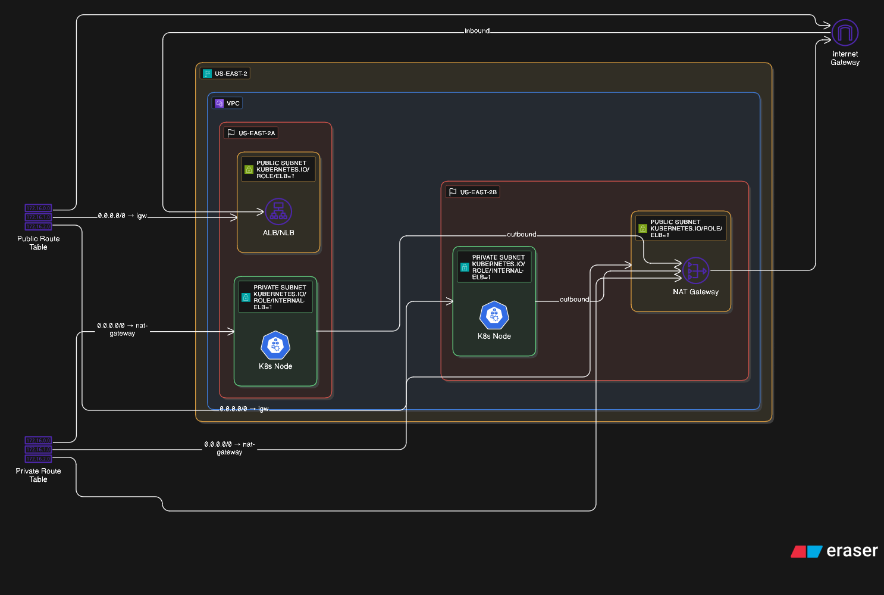

# AWS EKS Infrastructure

A comprehensive AWS EKS (Elastic Kubernetes Service) infrastructure setup using Terraform, featuring production-ready components including auto-scaling, ingress controllers, SSL/TLS termination, and various demo applications.

## Architecture Overview

This project deploys a complete EKS cluster with the following components:

- **EKS Cluster**: Kubernetes 1.31 running on AWS
- **VPC**: Multi-AZ setup with public/private subnets
- **Node Groups**: Auto-scaling worker nodes (t3.large instances)
- **Ingress Controllers**: NGINX Ingress with AWS Load Balancer Controller
- **SSL/TLS**: Cert-Manager for automatic certificate management
- **Storage**: EBS CSI Driver and EFS support
- **Security**: Pod Identity, RBAC, and IAM roles
- **Monitoring**: Metrics Server and Cluster Autoscaler

### Architecture 



This diagram illustrates the AWS EKS (Elastic Kubernetes Service) setup across multiple Availability Zones within a single region, focusing on network routing and component placement.

**High-Level Overview:**
The diagram depicts an AWS `US-EAST-2` region containing a `VPC`. Within this VPC, there are two Availability Zones: `US-EAST-2A` and `US-EAST-2B`. Each AZ contains both public and private subnets, with specific routing for inbound and outbound internet traffic. Kubernetes (K8s) nodes are deployed in private subnets, utilizing load balancers for inbound traffic and a NAT Gateway for outbound internet access.

**Detailed Breakdown:**

1.  **Region and VPC:**
    *   The outermost container is labeled `US-EAST-2`, representing an AWS region.
    *   Inside `US-EAST-2` is a `VPC` (Virtual Private Cloud), which acts as the isolated network environment.

2.  **Availability Zones (AZs):**
    *   The VPC is divided into two Availability Zones: `US-EAST-2A` (left side) and `US-EAST-2B` (right side). Each AZ is represented by a distinct colored box.

3.  **Public and Private Subnets:**
    *   **US-EAST-2A:**
        *   Contains a `PUBLIC SUBNET` labeled `KUBERNETES.IO/ROLE/ELB-1`. This subnet hosts an `ALB/NLB` (Application Load Balancer/Network Load Balancer), indicated by a load balancer icon.
        *   Contains a `PRIVATE SUBNET` labeled `KUBERNETES.IO/ROLE/INTERNAL-ELB=1`. This subnet hosts a `K8s Node`, represented by a Kubernetes icon.
    *   **US-EAST-2B:**
        *   Contains a `PRIVATE SUBNET` labeled `KUBERNETES.IO/ROLE/INTERNAL-ELB=1`. This subnet hosts a `K8s Node`.
        *   Contains a `PUBLIC SUBNET` labeled `KUBERNETES.IO/ROLE/ELB-1`. This subnet hosts a `NAT Gateway`, indicated by a network gateway icon.

4.  **Internet Connectivity:**
    *   An `Internet Gateway` (represented by a cloud icon with an 'n' shape) is located outside the VPC, providing internet access.
    *   **Public Route Table:**
        *   Located on the far left, it lists IP ranges `172.16.0.0`, `172.16.1.0`, `172.16.2.0`.
        *   It has a route `0.0.0.0/0 -> igw` (Internet Gateway).
        *   This route table is associated with the `PUBLIC SUBNET` in `US-EAST-2A` (where the ALB/NLB resides) and the `PUBLIC SUBNET` in `US-EAST-2B` (where the NAT Gateway resides).
    *   **Private Route Table:**
        *   Located below the Public Route Table, it also lists IP ranges `172.16.0.0`, `172.16.1.0`, `172.16.2.0`.
        *   It has a route `0.0.0.0/0 -> nat-gateway`.
        *   This route table is associated with the `PRIVATE SUBNET` in `US-EAST-2A` (where the K8s Node resides) and the `PRIVATE SUBNET` in `US-EAST-2B` (where the K8s Node resides).

5.  **Traffic Flow and Routing:**
    *   **Inbound Traffic:**
        *   Labeled "inbound" at the top.
        *   Traffic from the `Internet Gateway` flows into the `VPC`.
        *   It is routed via the `Public Route Table` to the `ALB/NLB` in the `PUBLIC SUBNET` of `US-EAST-2A`.
        *   From the `ALB/NLB`, traffic is directed to the `K8s Node` in the `PRIVATE SUBNET` of `US-EAST-2A`.
    *   **Outbound Traffic:**
        *   Labeled "outbound" at the top right, originating from the `K8s Node` in `US-EAST-2B`.
        *   Outbound traffic from the `K8s Node` in `US-EAST-2A` is routed via the `Private Route Table` (`0.0.0.0/0 -> nat-gateway`) to the `NAT Gateway` in the `PUBLIC SUBNET` of `US-EAST-2B`.
        *   Outbound traffic from the `K8s Node` in `US-EAST-2B` is also routed via the `Private Route Table` (`0.0.0.0/0 -> nat-gateway`) to the `NAT Gateway` in the `PUBLIC SUBNET` of `US-EAST-2B`.
        *   From the `NAT Gateway`, outbound traffic then flows to the `Internet Gateway`.

**Key Components and Their Roles:**
*   **ALB/NLB:** Handles incoming external traffic, distributing it to the K8s nodes. It resides in a public subnet.
*   **K8s Node:** Worker nodes for the Kubernetes cluster, residing in private subnets for enhanced security.
*   **NAT Gateway:** Allows instances in private subnets to connect to the internet or other AWS services, but prevents the internet from initiating connections to those instances. It resides in a public subnet.
*   **Internet Gateway:** Provides a target in VPC route tables for internet-routable traffic.
*   **Public Route Table:** Directs internet-bound traffic from public subnets to the Internet Gateway.
*   **Private Route Table:** Directs internet-bound traffic from private subnets to the NAT Gateway.

The diagram effectively illustrates a common, secure AWS EKS network architecture with high availability across two Availability Zones and proper separation of public and private resources.

## Project Structure

```
├── terraform/                    # Infrastructure as Code
│   ├── 0-locals.tf              # Local variables and configuration
│   ├── 1-providers.tf           # Terraform providers
│   ├── 2-vpc.tf                 # VPC and networking
│   ├── 3-igw.tf                 # Internet Gateway
│   ├── 4-subnets.tf             # Public/Private subnets
│   ├── 5-nat.tf                 # NAT Gateway
│   ├── 6-routes.tf              # Route tables
│   ├── 7-eks.tf                 # EKS cluster configuration
│   ├── 8-nodes.tf               # Worker node groups
│   ├── 9-add-developer-user.tf  # Developer IAM user
│   ├── 10-add-manager-role.tf   # Manager IAM role
│   ├── 11-helm-provider.tf      # Helm provider configuration
│   ├── 12-metrics-server.tf     # Metrics Server deployment
│   ├── 13-pod-identity-addon.tf # Pod Identity addon
│   ├── 14-cluster-autoscaler.tf # Cluster Autoscaler
│   ├── 15-aws-lbc.tf            # AWS Load Balancer Controller
│   ├── 16-nginx-ingress.tf      # NGINX Ingress Controller
│   ├── 17-cert-manager.tf       # Cert-Manager for SSL/TLS
│   ├── 18-ebs-csi-driver.tf     # EBS CSI Driver
│   ├── 19-openid-connect-provider.tf # OIDC Provider
│   ├── 20-efs.tf                # EFS configuration
│   ├── 21-secrets-store-csi-driver.tf # Secrets Store CSI Driver
│   ├── iam/                     # IAM policy documents
│   └── values/                  # Helm chart values
├── myapp/                       # Sample Go application
├── adminRole/                   # Admin role configurations
├── viewerRole/                  # Viewer role configurations
└── Various demo namespaces/     # Demo applications and configurations
```

##  Quick Start

### Prerequisites

- AWS CLI configured with appropriate permissions
- Terraform >= 1.0
- kubectl
- Helm 3.x
- Docker (for building the sample app)

### 1. Clone and Setup

```bash
git clone <repository-url>
cd "Aws Eks Infra"
```

### 2. Configure AWS

```bash
aws configure
# Enter your AWS Access Key ID, Secret Access Key, and region
```

### 3. Deploy Infrastructure

```bash
cd terraform
terraform init
terraform plan
terraform apply
```

### 4. Configure kubectl

```bash
aws eks update-kubeconfig --region us-east-2 --name staging-demo
```

### 5. Verify Deployment

```bash
kubectl get nodes
kubectl get pods --all-namespaces
```

## Configuration

### Environment Variables

The infrastructure is configured for the `staging` environment in `us-east-2` region. Key configurations in `terraform/0-locals.tf`:

```hcl
locals {
  env         = "staging"
  region      = "us-east-2"
  zone1       = "us-east-2a"
  zone2       = "us-east-2b"
  eks_name    = "demo"
  eks_version = "1.31"
}
```

### Node Configuration

- **Instance Type**: t3.large
- **Capacity Type**: ON_DEMAND
- **Scaling**: 0-10 nodes (auto-scaling enabled)
- **Zones**: Multi-AZ deployment

##  Included Components

### Core Infrastructure

- **EKS Cluster**: Kubernetes 1.31 with API server access
- **VPC**: 10.0.0.0/16 CIDR with DNS support
- **Subnets**: Public and private subnets across 2 AZs
- **NAT Gateway**: For outbound internet access from private subnets

### Kubernetes Add-ons

1. **Metrics Server**: Resource metrics for HPA and autoscaling
2. **Cluster Autoscaler**: Automatic node scaling based on demand
3. **AWS Load Balancer Controller**: Native AWS load balancer integration
4. **NGINX Ingress Controller**: External traffic routing
5. **Cert-Manager**: Automatic SSL/TLS certificate management
6. **EBS CSI Driver**: Persistent volume support
7. **EFS CSI Driver**: Shared file system support
8. **Secrets Store CSI Driver**: External secret management

### Security Features

- **Pod Identity**: Secure AWS service access from pods
- **RBAC**: Role-based access control
- **IAM Roles**: Fine-grained permissions
- **Network Security**: Private subnets for worker nodes

## Demo Applications

The project includes several demo applications to showcase different features:

### 1. Sample Go Application (`myapp/`)
- Simple HTTP server with CPU load testing endpoint
- Health check and version endpoints
- Dockerized for easy deployment

### 2. Demo Namespaces
- **autoscaler-demo**: HPA (Horizontal Pod Autoscaler) demonstration
- **ebs-csi**: EBS persistent volume example
- **efs-namespace**: EFS shared storage example
- **lb-demo**: Load balancer demonstration
- **myapp-namespace**: Sample app with HPA
- **nginx-ingress**: Basic ingress example
- **nginx-ingress-tls**: SSL/TLS ingress example
- **plain-ingress**: Simple ingress configuration
- **ssl-ingress**: SSL-enabled ingress
- **secret-store**: External secrets management

## Access Control

### Admin Role
- Full cluster access
- Located in `adminRole/` directory

### Viewer Role
- Read-only access to cluster resources
- Located in `viewerRole/` directory

### Developer User
- Limited access for development work
- Configured in `terraform/9-add-developer-user.tf`

## Ingress and Load Balancing

### NGINX Ingress Controller
- External load balancer with internet-facing scheme
- NLB target type: IP
- Supports both HTTP and HTTPS traffic

### SSL/TLS Configuration
- Automatic certificate provisioning with Let's Encrypt
- Cert-Manager integration
- ClusterIssuer for certificate management

## Monitoring and Scaling

### Metrics Server
- Collects resource metrics from nodes and pods
- Enables HPA and VPA functionality

### Cluster Autoscaler
- Automatically scales worker nodes based on demand
- Integrated with AWS Auto Scaling Groups
- Pod Identity for secure AWS API access

### Horizontal Pod Autoscaler (HPA)
- Demo applications include HPA configurations
- CPU-based scaling policies

## Storage Options

### EBS CSI Driver
- Block storage for stateful applications
- Persistent volumes with various storage classes

### EFS CSI Driver
- Shared file system across multiple pods
- NFS-based persistent volumes

### Secrets Store CSI Driver
- External secret management
- Integration with AWS Secrets Manager

## Deployment Examples

### Deploy Sample Application

```bash
# Build and push the sample app
cd myapp
docker build -t your-registry/myapp:latest .
docker push your-registry/myapp:latest

# Deploy to cluster
kubectl apply -f myapp-namespace/
```

### Deploy with Ingress

```bash
# Deploy with SSL/TLS
kubectl apply -f nginx-ingress-tls/
```

### Test Auto-scaling

```bash
# Deploy autoscaler demo
kubectl apply -f autoscaler-demo/

# Generate load to trigger scaling
kubectl run -i --tty load-generator --rm --image=busybox --restart=Never -- /bin/sh
# Inside the pod:
while true; do wget -q -O- http://your-app-service/api/cpu?index=30; done
```

## Customization

### Modify Node Configuration
Edit `terraform/8-nodes.tf` to change:
- Instance types
- Scaling parameters
- Node labels and taints

### Update EKS Version
Modify `eks_version` in `terraform/0-locals.tf`

### Add New Components
Create new Terraform files following the naming convention:
- `XX-component-name.tf`

## Cleanup

To destroy the infrastructure:

```bash
cd terraform
terraform destroy
```

**Warning**: This will delete all resources and data. Make sure to backup any important data.

## Notes

- The cluster uses Pod Identity for secure AWS service access
- All worker nodes are deployed in private subnets
- Public access is available through the API server endpoint
- SSL/TLS certificates are automatically managed by Cert-Manager
- The infrastructure is designed for staging/production use

**Happy Kubernetes-ing!**
